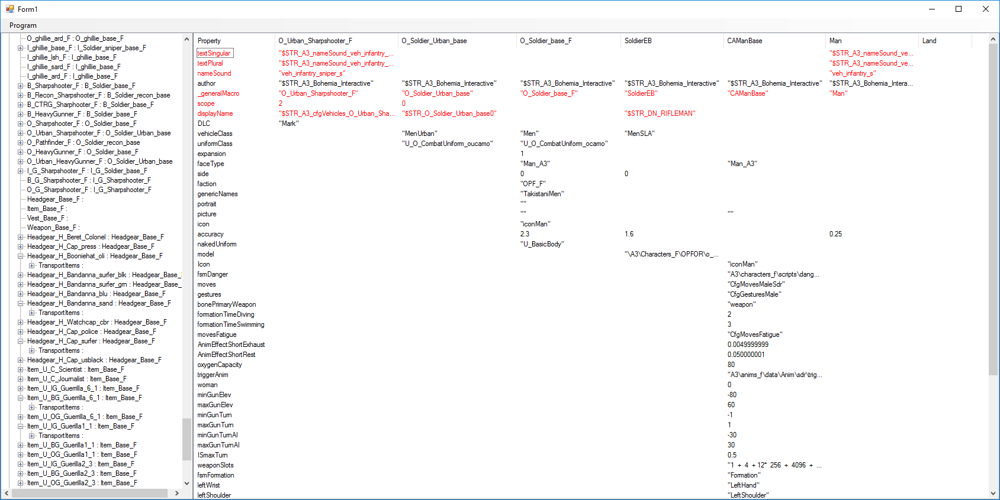

# arma_config_viewer

Small tool to view classes from a config.cpp for arma (game oder mods). 
Treeview on left side is hierarchical from config 
Listview in right side, contains all listed properties in config incl. all known inhierts classes. 

red marked lines: active object value changed from inherit classes

